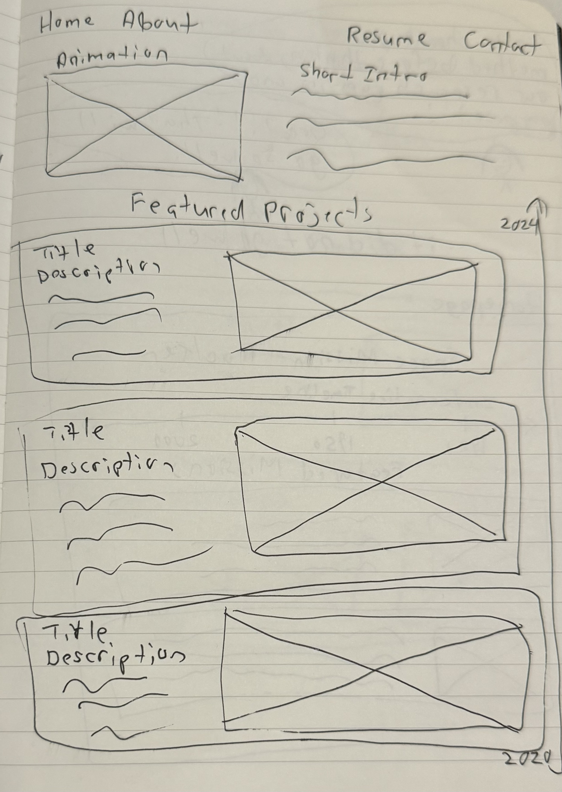
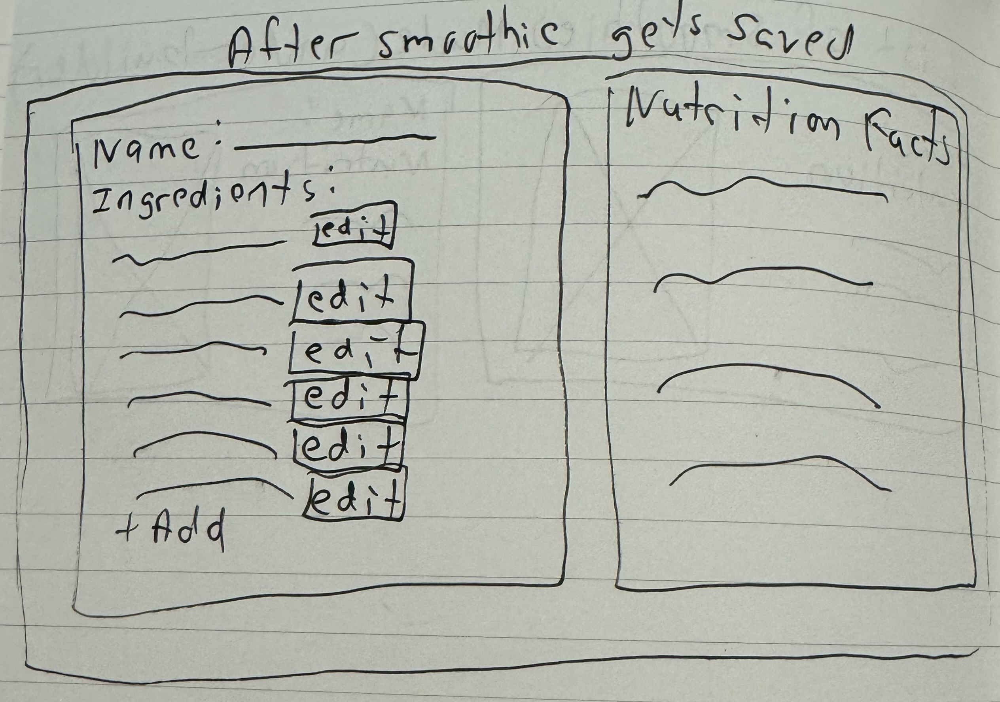

<mark>**Note that this document order from FP4 -> FP1**</mark>

<mark>Please sign up for the study</mark> at [https://tinyurl.com/pui-study](https://tinyurl.com/pui-study) to allow us to use your submission to create a better GenAI assistant for designers!

---

# **FP4 \- Final Project Writeup**

Feel free to refer to this [Markdown Cheat Sheet](https://www.markdownguide.org/cheat-sheet/) to make your writeup more organized, and you can preview your markdown file in VSCode [Markdown editing with Visual Studio Code](https://code.visualstudio.com/docs/languages/markdown#_markdown-preview). 

## Part 1: Website Description

Describe your website (300 words).

* What is the purpose of your website?   
* Who is the target audience?  
* What information do you convey with your website?   
* How is it interesting and engaging? 

The purpose of my website was to create a personal portfolio for me to feature my work as a UX Designer and start applying for jobs. The target audience is for recruiters, faculty, and fellow peers to see the work I have done in school and in my career. The purpose is so I am able to showcase my work all in one place. I did have a portfolio before, but my old portfolio was a little too rigid and there wasn't much space for me to express my creativity more. I also wanted a cleaner, sleek look which is why I wanted to go with a default dark theme with the blue cyan color as the accent. It fits my personal style a lot more and showcases my work effectively. The information I'm conveying with my website is a collection of the work I have done so far. I made it interesting and engaging by the visual aspect of the modern sleep look, and also made it more interesting with the typing animation, text animations, and having the titles of my project on the left side pop up when that specific project is in view. Another aspect that I decided to add during the last few days of working on this project was the ability to change from dark mode to light mode. 

## Part 2: User Interaction

How a user would interact with your website? For each step, briefly but clearly state the interaction type & how we should reproduce it.

1. Hover interaction. Hover over the nav bar and the text will highlight 
2. Hover interaction. Hover over each individual project and the project border will highlight and expand
3. Hover interaction. Hover over each skill and the skill will highlight
4. Toggle between dark and light mode. Toggle between light and dark mode.
5. Scrolling interaction. Scroll down the home page/projects section and a scroll wheel of the titles of my projects will show up and highlight as each individual project comes up.
6. Typing interaction. As you load the page, an animation of my header being typed will show. 
6. Links
    - Home: Links to home page
    - About: Links to about page
    - Projects: Links to the projects section
    - Resume: Links to my resume
    - Contact: links to email 
6. Buttons
  - Let's Chat: links to sending me an email
  - Resume: links to my resume

## Part 3: External Tool

Describe what important external tool you used (JavaScript library, Web API, animations, or other). Following the bulleted list format below, reply to each of the prompts.

1. Typing animation 
   * Why did you choose to use it over other alternatives? (2 sentences max)  
    The typing animation for my header when you load the page adds a little bit of motion to my page. I originally thought of just having the text slide in, but I thought the typing effect would add to the page more. 
   * How you used it? (2 sentences max)  
      I used it for the header of my hero section when you load the page.
   * What does it add to your website? (2 sentences max)  
    It adds motion and an animation effect when you load the page. 
2. Text animations on hover
 * Why did you choose to use it over other alternatives? (2 sentences max)  
    I was thinking that on portfolios, there can be a lot of text. This was my way of making reading a little more interactive and fun, other effects didn't give the same appeal. 
   * How you used it? (2 sentences max)  
      I used it for my navigation section, skill boxes, and section boxes for my projects. 
   * What does it add to your website? (2 sentences max)  
    It adds motion and an animation effect when you hover over certain text and boxes. 
3. Scroll wheel navigation on the left side
 * Why did you choose to use it over other alternatives? (2 sentences max)  
    During my initial mockups, I was thinking of having a scrollable timeline. This then evolved into a scrollable project title section where each title would light up as the user scrolls on the page and I used this over other alternatives, since just having dates wouldn't add as much.  
   * How you used it? (2 sentences max)  
      I used it for scrolling, where when you scroll on the page, each project lights up. This also helps give a brief overview of all my projects. 
   * What does it add to your website? (2 sentences max)  
    It gives a brief high-level overview of all my projects and gives a visual appeal.

## Part 4: Design Iteration

Describe how you iterated on your prototypes, if at all, including any changes you made to your original design while you were implementing your website and the rationale for the changes. (4-8 sentences max)

My original mockups included the dark theme and blue accents. That was the main thing I kept throughout the whole process, but the main things I changed were adding more animations and changing the timeline to the scroll wheel view for my projects. I also made my section boxes a little more visually appealing by adding the skill boxes and creating hover animations for that and the entire sections. One of the biggest things I added was the ability to change the dark mode to light mode. 

## Part 5: Implementation Challenge

What challenges did you experience in implementing your website? (2-4 sentences max)

The biggest challenge was implementing the scroll wheel aspect on the left side, I had to learn a ton about Intersection Observer. Sometimes the scroll view would highlight the wrong projects, not highlight the correct project, or it just wouldn't work. The other big challenge was integrating the light to dark mode aspect, but the scroll wheel was definitly the most challenging. Another small thing was just knowing the correct syntax for stuff, but I figured out that quickly by simply looking it up or asking ChatGPT.

## Part 6: Generative AI Use and Reflection

Describe how you used Generative AI tools to create this final project (fill in the following information, write \~500 words in total).

Document your use of all GenAI tools — ChatGPT, Copilot, Claude, Cursor, etc. using the template below. Add/Delete rows or bullet points if needed, and replace Tool1/Tool2 with the name of the tool.

The only AI tool I've ever really used is ChatGPT. I used it to get quick help on syntax errors and quick explanations on how do do things. An example of a simple thing I needed help with was that I forgot how you link the nav to certain sections. It was also pretty helpful for debugging. When I was a Computer Science major in undergrad, debugging would take a painful long amount of time, but using ChatGPT to help debug has been so useful. In this project I specifically used it to help debug the scroll view on the left side containing the names of all my projects. I also used it to generate some ideas. I was surprised I didn't really use it more for refining my design and original mockups. Maybe it would have been good to do that, but the only help I got from it for my design was when I asked it what other animations or interactions I could add since I definitely didn't have enough in the beginning. It gave me the idea of a typing animation and also linked to helpful documentation about that and other aspects. It also helped me determine how feasible certain things were, such as the scroll view with the names of my projects and I also asked it how feasible the light and dark theme would be. ChatGPT was very helpful in that aspect and in providing documentation that actually helped a lot. 

### Usage Experiences by Project Aspects

Feel free to edit the column \_ (other?) or add more columns if there's any other aspect in your project you've used the GenAI tools for.

For the following aspects of your project, edit the corresponding table cell to answer:
- *Usage*: Whether you used / did not use this tool for the aspect. Enter [Yes/No]
- *Productivity*: Give a rating on whether this tool makes your productivity for X aspect [1-Much Reduced, 2-Reduced, 3-Slightly Reduced, 4-Not Reduced nor Improved, 5-Slightly Improved, 6-Improved, 7-Much Improved].

| Tool Name | Ratings | design | plan | write code | debug | \_ (other?) |
| :---- | :---- | :---- | :---- | :---- | :---- | :---- |
| ChatGPT | Usage | No | Yes | No | Yes | Yes/No |
| ChatGPT | Productivity | 0 | 7 | 0 | 7 | 0 |

### Usage Reflection

> Impact on your design and plan 
* It matched my expectations and plan in [FP2](#generative-ai-use-plan) in that … For example, 
  1. ChatGPT: It helped me figure out what other animations I could add and help for the syntax of these animations. I did also use it to debug, this was very helpful since if I debugged by myself it would have taken me a very long time to figure out my erros. 
* It did not match my expectations and plan in [FP2](#generative-ai-use-plan) in that … For example, 
  1. ChatGPT: I ended up not really using AI to refine my ideas. The only part that I asked for help on refining my ideas were when I asked it what other animations I could put for my project. I also asked it how feasible certain things were, like how hard is implementing light and dark mode. This helped ease my worries and assess how much time something could take. 
* GenAI tool did/did not influence my final design and implementation plan because … For example, 
  1. ChatGPT: Same explanation as above. I didn't really use AI to refine my ideas and final design. At most, it helped me figure out what other animations I could add and help for the syntax of these animations. 

> Use patterns
* I accepted the generations when …  For example, 
  1. ChatGPT this tool once suggested I add a typing animation and I adjusted my design according to the suggestion because I wanted another animation but I wasn't sure what. 
* I critiqued/evaluated the generated suggestions by … For example, 
  1. ChatGPT: this tool once suggested that I add more hovering effects but I rejected the suggestion because I already had a lot of hovering animations. 

> Pros and cons of using GenAI tools
* Pros
  1. ChatGPT: Quick explanations of syntax errors and quick explanations and links to documentation for implementing things I wasn't as familiar with. 
* Cons
  1. ChatGPT: Sometimes what it said wasn't all that helpful, so I'd just look up documentation or other help on Google

### Usage Log

Document the usage logs (prompts and chat history links) for the GenAI tools you used. Some tools may not have an easy way to share usage logs, just try your best! Some instructions for different tools:

1. [ChatGPT](https://chatgpt.com/share/6753cf3f-97d0-8011-a616-697866c3b4b9) 
---

# **FP3 \- Final Project Check-in**

Document the changes and progress of your project. How have you followed or changed your implementation & GenAI use plan and why? Remember to commit your code to save your progress.

## Implementation Plan Updates

- [ ] Week 9 Oct 28 \- Nov 1:
  - [X] FP1 due
  - [x] Prototype my designs
  - [x] Test my designs
  - [x] Synthesize the results of the user testing

  
- [x] Week 10 Nov 4 \- Nov 8:   
  - [x] FP2 due
  - [x] Incorporate critiques from user testing
  - [x] Map out implementation plan

- [x] Week 11 Nov 11 \- Nov 15:  
    - [x] Implement HTML/CSS
    - [x] Start on JS and functionality (implement at least 1 feature)
    - [x] Pick which library to use
    - [x] Add more animations 
- [x] Week 12 Nov 18 \- Nov 22:   
    - [x] FP3 due
    - [x] Implement the rest of the designs
    - [x] Make sure site is accessible
- [x] Week 13 Nov 25 \- Nov 29:  
  - [x] Thanksgiving  
  - [x] Prepare final designs and presentation 
- [x] Week 14 Dec 2 \- Dec 6:  
  - [x] Implement light and dark mode
  - [x] Make sure library is implemented
  - [x] Ensure site is accessible 
  - [x] FP4 due 

## Generative AI Use Plan Updates

- I ended up not really using AI to refine my ideas. The only part that I asked for help on refining my ideas were when I asked it what other animations I could put for my project. I also asked it how feasible certain things were, like how hard is implementing light and dark mode. This helped ease my worries and assess how much time something could take. 

Remember to keep track of your prompts and usage for [FP4 writeup](#part-6-generative-ai-use-and-reflection).

---

# **FP2 \- Evaluation of the Final project**

## Project Description

My current portfolio is too cookie-cutter. It does have all of my projects showcased but it’s not as visually appealing or personalized as it could be. I want my portfolio to be more eye-catching and include interactive elements and animations. 

## High-Fi Prototypes

### *Prototype 1*

The home page was well-recieved in the user feedback session. They liked the accent color and the dark theme. They thought NASA was very impressive but they said I need to make sure I don't pigeon-hole myself into making it seem like I only want to work for NASA and the aerospace industry. I also needed to put a call to action button for my projects so that the user knows when the project ends instead of infinite scrolling. 

### *Prototype 2*

The majority of the feedback was for my Home page. My projects page didn't get as much feedback since the home page is the main focus of the portfolio since that's what people would generally see first. I think in the future when I'm implementing my designs I will add more pictures to it and try to match the darker theme of my home page.

## Usability Test
During the usability test i gave the users two tasks. The tasks were pretty simple but the first task was for the user to navigate into my second project on the home page. The second task was to navigate back to the home page after going into my second project. The suggestions were to make the projects a little more unified so that the text would be on one side and the project would be on the other. 

The feedback given was that my current designs might pigeon-hole me too much in that recruiters may think I only want to work for NASA and the aerospace industry so I should change the blue color into something else and not put the rocket animation next to my name. Otherwise, they loved the accent color since it brought out a pop of color against the dark background. Another piece of feedback was that the navigation bar was oddly spaced and that I should make images have a radius instead of it being pointy to match current design trends. My projects were also presented in not the most efficient way since I should add a call to action button and to make it known where the project actually ends. Majority of the feedback was for the home page.

## Updated Designs

## Feedback Summary

For the home page I changed the color of the blue to the color green based on the feedback I got that blue might look too much like "space." I also moved the rocket animation down to my actual NASA project section instead of having it at the top. I changed the radius of my images to have a curved radius instead of it being pointy. I also included a call to action button and made my images all on one side to make my projects section more readable. 

## Milestones

Outline weekly milestones to plan your expected implementation progress until the end of the semester (\~300 words). 

### *Implementation Plan*

- [ ] Week 9 Oct 28 \- Nov 1:
  - [X] FP1 due
  - [x] Prototype my designs
  - [x] Test my designs
  - [x] Synthesize the results of the user testing

  
- [x] Week 10 Nov 4 \- Nov 8:   
  - [x] FP2 due
  - [x] Incorporate critiques from user testing
  - [x] Map out implementation plan

- [ ] Week 11 Nov 11 \- Nov 15:  
    - [ ] Implement HTML/CSS
    - [ ] Start on JS and functionality (implement at least 1 feature)
- [ ] Week 12 Nov 18 \- Nov 22:   
    - [ ] FP3 due
    - [ ] Implement the rest of the designs
    - [ ] Make sure site is accessible
- [ ] Week 13 Nov 25 \- Nov 29:  
  - [ ] Thanksgiving  
  - [ ] Prepare final designs and presentation 
- [ ] Week 14 Dec 2 \- Dec 6:  
  - [ ] FP4 due 

### *Libraries and Other Components*

I plan to use react.js to build out my UI. I also plan to use Framer for my transitions and animations
* 

## Generative AI Use Plan

Outline how you plan to use Generative AI tools to aid in the implementation (\~300 words).

### *Tool Use*

 What would you use? Edit the list given your plan. For each tool, explain briefly on what do you expect Generative AI to help you with and what might it not be able to help you with.

* ChatGPT  
  * I will use it for refining my ideas because it might help me think outside the box.
  * I will not use it for coding my entire website since that won't help me learn.  

### *Responsible Use*

How would you use Generative AI responsibly? 

I would use it to just help me to refine my ideas. I won't use it to replace my critical thinking I'll just use it as a tool.

---

# **FP1 \- Proposal for Critique**

## Idea Sketches

### *Idea 1*

* I'm redesigning my personal portfolio. My current portfolio is too cookie-cutter and not personalized. 
* I plan to add animations and an interactive timeline to add more of a storytelling element into it.
* I plan to make my design accessible by using colors that contrast well with each other and making text and images large enough. I would also want to add a screen reader.
* I want to include info about myself and the projects I've done. 

### *Idea 2*

* This is a site that displays info about past, current, and future space missions. 
* There’s so many space missions going on, it would be nice to have a site where you can see how every mission relates to each other. I want to include a timeline, details about each mission, and a fun fact section.
* I plan to make my design accessible by using colors that contrast well with each other and making text and images large enough. I would also want to add a screen reader.

### *Idea 3*

* This will be a customizable smoothie builder where users can create their ideal smoothie based on their goals 
* This will help users discover new recipes and flavors. 
* I plan to make my design accessible by using colors that contrast well with each other and making text and images large enough. I would also want to add a screen reader.

## Feedback Summary

* Portfolio Feedback: They all liked the idea of the interactive timeline. Ways to make it more interactive and more storytelling is to have a cursor with an icon that's personalized to me. For case study page use a timeline for steps of the case study instead of the time. 

* Space Mission Tracker: Suggested to be more accessibile for people using screen readers. Also I need to think more about how to deal with the amount of information. They agreed with me that I should just stick to missions in the United States since if I did international that would be a lot of information. The other critique was also needing to think about how to sort everything and to probably have some kind of sorting button. 

* Smoothie Builder: A suggestion was to add a list of favorite smoothies, and to have the site tell you the flavor profile of the smooothie. Someone raised a good question of, "How will you calculate the nutrition facts if you don’t have a measurement option?" So I will need to add in a measurement option so I can quantify the nutrition. 

## Feedback Digestion

I have decided to go with my personal portfolio as my final project for this semester. I like the aspect of the storytelling and making something that's a bit more personal to me. I really like the ideas and questions my group raised when I was presenting my project. I will be adding in more elements of interactivity and storytelling by making my cursor have an icon that travels with it when the mouse moves. I will also keep the timeline of it. 

